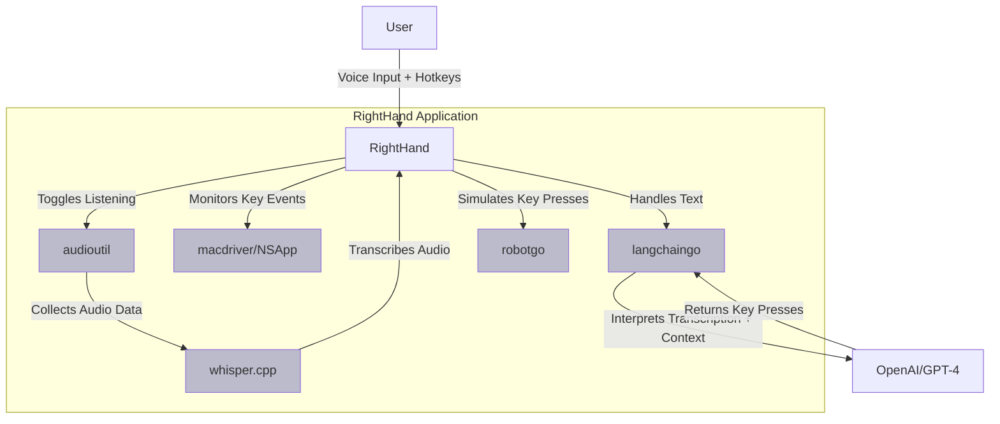

# RightHand - Voice Controlled Assistant for Mac

RightHand is a voice controlled assistant for macOS, built using Go. With the power of RightHand, you can control your apps with voice commands, making your workflow smoother and more efficient. Whether it's opening a file, navigating through your apps, or even controlling your music player, everything can be done by your voice.

## Quick Start (Copy/Paste)

```bash
# 1. Install Homebrew if you don't have it
/bin/bash -c "$(curl -fsSL https://raw.githubusercontent.com/Homebrew/install/HEAD/install.sh)"

# 2. Install Go and PortAudio
brew install go portaudio

# 3. Set up Go environment (if not already done)
echo 'export GOPATH=$HOME/go' >> ~/.zshrc
echo 'export PATH=$PATH:$GOPATH/bin' >> ~/.zshrc
source ~/.zshrc

# 4. Install RightHand
go install github.com/tmc/righthand@latest

# 5. Create config directory
mkdir -p ~/.config/righthand

# 6. Set your OpenAI API key (replace 'your-api-key-here' with your actual key)
echo 'export OPENAI_API_KEY=your-api-key-here' >> ~/.zshrc
source ~/.zshrc

# 7. Run RightHand
righthand
```

After running, press Command+Control to start voice recognition. You may need to:
1. Grant microphone permissions in System Settings > Privacy & Security
2. Replace 'your-api-key-here' with your actual OpenAI API key from https://platform.openai.com/api-keys

RightHand leverages several powerful libraries such as `robotgo` for simulating keyboard input, `whisper` for voice recognition, `macdriver` for creating macOS applications using Go, and `langchaingo` for Language Learning Model interpretation. This software uses OpenAI's GPT-4 model to interpret transcriptions and generate corresponding commands.

Righthand uses the lovely [macdriver](https://github.com/progrium/macdriver) project to enable MacOS api interactions.

## Motivation


Two weeks before initially publishing this I got into a pretty bad mountain biking accident. I built this for myself to better use my computer with a mix of one-handed typing and voice control.

## Features

1. **Voice Recognition**: Leveraging the `whisper` model, RightHand can accurately transcribe spoken words into text.
2. **Natural Language Understanding**: RightHand uses `langchaingo` with OpenAI's GPT-4 model to understand the context of your speech and execute relevant actions.
3. **Contextual Awareness**: RightHand adapts its responses based on the currently active application, providing a tailored user experience.
4. **Hands-Free Control**: Perform actions such as opening files, navigating through apps, controlling media playback, and more using just your voice.

## Installation

### Prerequisites

1. **Go**: Make sure you have Go 1.20 or later installed. You can download it from [golang.org](https://golang.org/dl/)

2. **PortAudio**: Required for audio capture
   - macOS: `brew install portaudio`
   - Linux: `sudo apt-get install portaudio19-dev` (Ubuntu/Debian)

3. **OpenAI API Key**: RightHand uses OpenAI's GPT-4 and Whisper models. You'll need an API key:
   1. Get your API key from [OpenAI's website](https://platform.openai.com/api-keys)
   2. Set it as an environment variable:
      ```shell
      export OPENAI_API_KEY='your-api-key-here'
      ```

### Installing RightHand

1. Install the application:
   ```shell
   go install github.com/tmc/righthand@latest
   ```

2. Verify the installation:
   ```shell
   righthand -h
   ```

### Configuration

RightHand will create a default configuration file at `~/.config/righthand/config.yaml` on first run. You can customize:

- `llm_model`: The OpenAI model to use (default: "gpt-4")
- `whisper_model`: The Whisper model to use (default: "base.en")
- Program-specific voice commands

### Troubleshooting

If you encounter issues:

1. **Audio Capture Issues**:
   - Ensure PortAudio is installed correctly
   - Check microphone permissions in System Settings > Privacy & Security > Microphone

2. **API Key Issues**:
   - Verify your OpenAI API key is set correctly
   - Check you have sufficient API credits

3. **Build Issues**:
   - Ensure all dependencies are installed: `go mod tidy`
   - Make sure you're using a supported Go version

For more help, please [open an issue](https://github.com/tmc/righthand/issues).

## Usage

```shell
$ righthand
```

You can toggle the listening state of RightHand by pressing the control key while holding down the command key. RightHand will start transcribing your speech, interpret it, and execute commands on the active application.

## Architecture



## Contributing

Contributions to RightHand are most welcome! If you have a feature request, bug report, or have developed a feature that you wish to be incorporated, please feel free to open a pull request.

