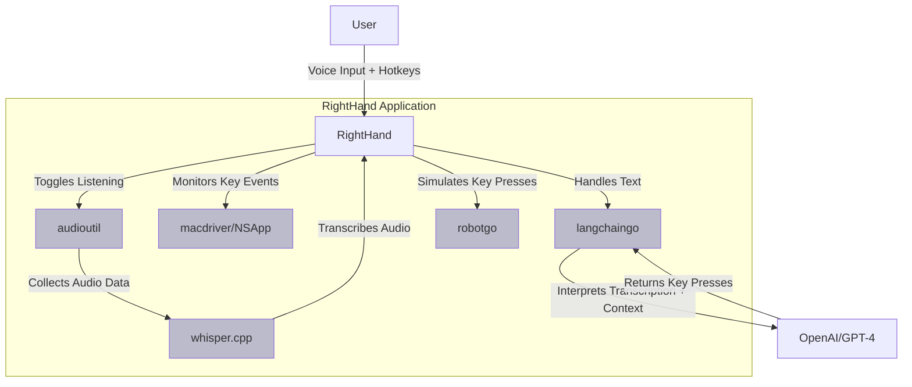

# RightHand - Voice Controlled Assistant for Mac

RightHand is a voice controlled assistant for macOS, built using Go. It makes use of several powerful libraries such as `robotgo` for simulating keyboard input, `whisper` for voice recognition, `macdriver` for creating macOS applications using Go, and `langchaingo` for Language Learning Model interpretation. This software uses OpenAI's GPT-4 model to interpret transcriptions and generate corresponding commands.

## Motivation


Two weeks before initially publishing this I got into a pretty bad mountain biking accident. I built this for myself to better use my computer with a mix of one-handed typing and voice control.

## Features

1. **Voice Recognition**: Leveraging the `whisper` model, RightHand can accurately transcribe spoken words into text.
2. **Language Learning Model**: RightHand uses `langchaingo`, with OpenAI's GPT-4 model to interpret the transcribed text and generate commands.
3. **Active App Context**: RightHand considers the context of the currently active application to interpret and execute commands appropriately.

## Installation

Ensure that Go is installed on your machine. To install RightHand, clone the repository and run:

```shell
$ go install github.com/tmc/righthand@main
```

## Usage

```shell
$ righthand
```

You can toggle the listening state of RightHand by pressing the control key while holding down the command key. RightHand will start transcribing your speech, interpret it, and execute commands on the active application.

## Architecture



## Contributing

Contributions to RightHand are most welcome! If you have a feature request, bug report, or have developed a feature that you wish to be incorporated, please feel free to open a pull request.

